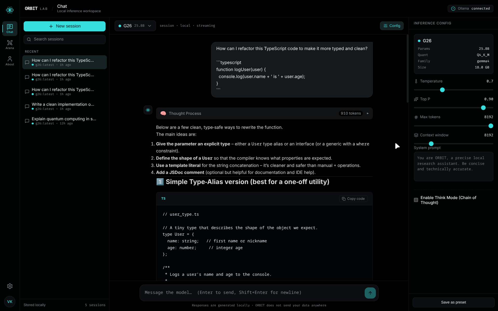
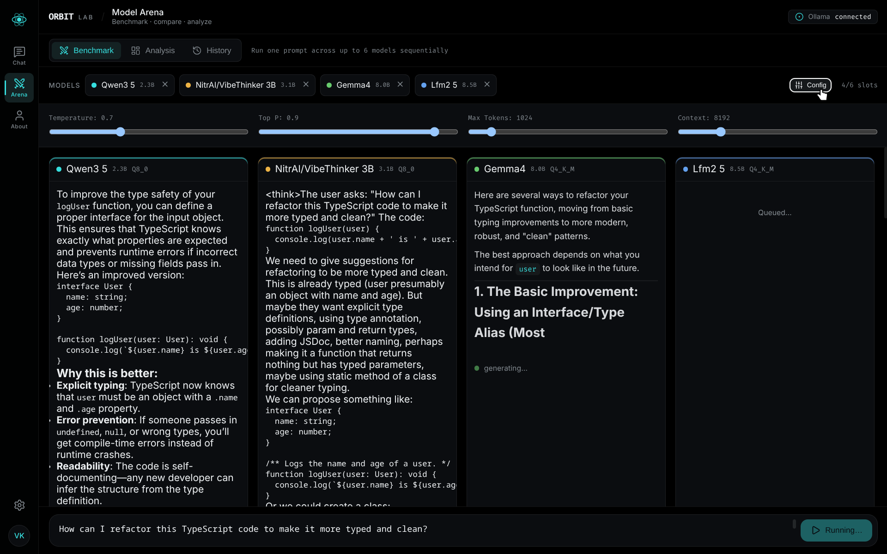
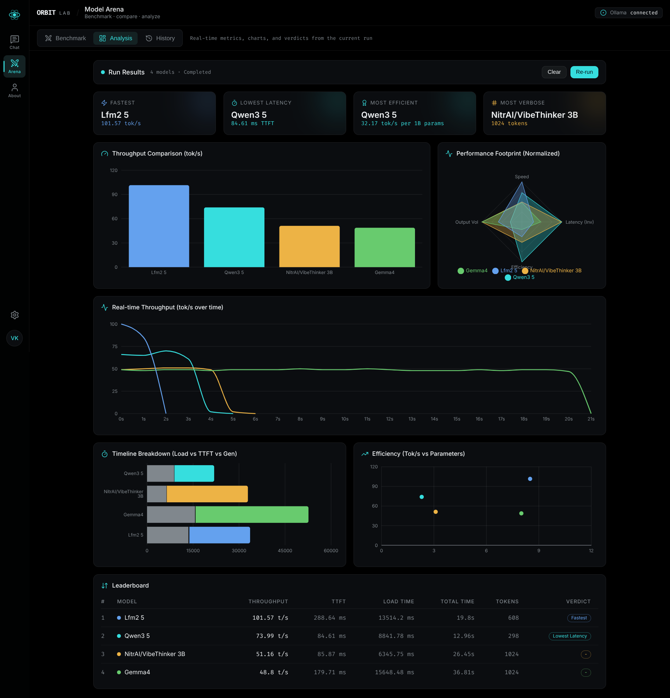

# ORBIT Lab

ORBIT Lab is a lightweight, local-first AI models comparision benchmarking focused on open-source language models.

The project aims to simplify the workflow of AI developers by providing a simple and minimal way to compare multiple local models.

---

## 🚀 Quick Start

**New to ORBIT?** Start here:

→ [**Getting Started Guide**](./Documents_For_Developers/GETTING_STARTED.md) - Step-by-step setup for beginners

**Want technical details?**

→ [**Chat Interface Documentation**](./Documents_For_Developers/ChatInterface.md) - Chat architecture, SSE streaming, and system prompts  
→ [**Arena Benchmark Documentation**](./Documents_For_Developers/ArenaBenchmark.md) - Benchmarking architecture, metrics extraction, and real-time visualization  

---

## 📚 Documentation

| Document | Purpose |
|----------|---------|
| [GETTING_STARTED.md](./Documents_For_Developers/GETTING_STARTED.md) | Complete setup guide with all dependencies and commands |
| [ChatInterface.md](./Documents_For_Developers/ChatInterface.md) | Technical architecture of the unified chat interface |
| [ArenaBenchmark.md](./Documents_For_Developers/ArenaBenchmark.md) | Details on the multi-model benchmarking pipeline |
| [README.md](./README.md) | Project overview and vision (this file) |

---

## 🎯 Core Features

### 1. Chat Workspace
<p align="center">
  
</p>

- **Real-time SSE Streaming**: Live chunk-by-chunk markdown rendering.
- **Think Mode (Chain of Thought)**: Expandable thought process blocks with dynamic token counters for reasoning models.
- **Stop Generation**: Graceful stream abortion using AbortControllers.
- **System Prompts & Parameters**: Fine-tune context length, temperature, top-p, and set custom personas.
- **Performance Metrics**: View native token metrics (Tokens/sec, Time-To-First-Token) immediately after generation.
- **Session Persistence**: Drafts, configurations, and chat histories are seamlessly saved to `localStorage`.

### 2. Model Arena
<p align="center">
  
</p>

- **Multi-Model Benchmarking**: Queue up to 6 local Ollama models simultaneously.
- **Sequential Execution**: Models are benchmarked one-by-one to preserve system resources and hardware safety.
- **Live Chunk Streaming**: Watch each model generate its response in real-time, throttled for UI performance.

### 3. Analysis Dashboard
<p align="center">
  
</p>

- **Real-time Throughput**: Line Chart tracking tokens/sec across the duration of the entire benchmark generation.
- **Throughput Comparison**: Vertical Bar Chart directly comparing total speed per model.
- **Performance Footprint**: Visual Radar Chart normalizing Speed, Latency, Efficiency, and Volume.
- **Timeline Breakdown**: Stacked Composed Chart detailing Load Time, TTFT, and Generation Time.

---

## 🛠️ Tech Stack

### Frontend
- **Framework**: React 19 + TypeScript + Vite
- **Routing**: React Router DOM (with Keep-Alive architecture)
- **Data Visualization**: Recharts
- **Markdown Processing**: React-Markdown + Remark-GFM + Rehype-Katex
- **Icons**: Lucide React
- **Styling**: Vanilla CSS Modules (CSS Variables & Flexbox/Grid)

### Backend
- **Framework**: FastAPI (Python)
- **AI Integration**: Official Ollama Python Client
- **Architecture**: Modular API router system
- **Validation**: Pydantic

---

## 📊 Project Status

🚧 **Beta Phase**

ORBIT has completed its Phase 2 expansion. Both the Chat Workspace and the Model Arena are fully operational with shared streaming utilities, global state persistence, and rich data visualization.

---

## 👨‍💻 Development Notes

### Project Structure
```text
ORBIT/
├── Documents_For_Developers/    # Technical Documentation
├── backend/                     # Python FastAPI Backend
│   ├── modules/                 # Endpoint routers (chat/, arena/)
│   └── utils/                   # Shared logic (llm.py)
├── frontend/                    # React UI
│   ├── src/
│   │   ├── components/          # Feature-based folder structure
│   │   │   ├── chat/
│   │   │   ├── arena/
│   │   │   └── common/
│   │   ├── pages/               # React Router pages
│   │   ├── services/            # API fetchers (chatService, arenaService)
│   │   └── types/               # TypeScript Definitions
├── main.py                      # Uvicorn entry point
└── README.md                    
```

**Last Updated:** June 2026
